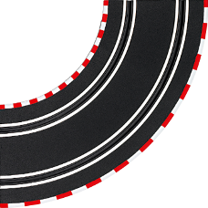
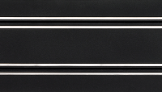
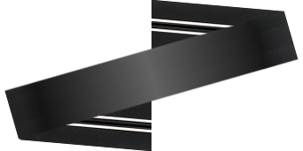

# Carrera Go !!!

| Part Code | Image |
|---|---|
| A.. |  |
| Apl |  |
| B.. |  |
| C.. |  |
| D.. |  |
| E.. |  |
| Fd. |  |
| Fg. |  |
| Gd. |  |
| Gg. |  |
| H.. |  |
| I.. |  |
| K.. |  |
| L1d | |
| L1g | |
| L2d | |
| L2g | |
| Md. |  |
| Mg. |  |
| nd. |  |
| ng. |  |
| Ngg |  |
| Np. |  |
| Ng. |  |
| Npg |  |
| Od. |  |
| Og. |  |
| Qad |  |
| Qda |  |
| r.. |  |
| Rd. |  |
| Rg. |  |
| Sd. |  |
| Sg. |  |
| Y1g |  |
| Y2g |  |
